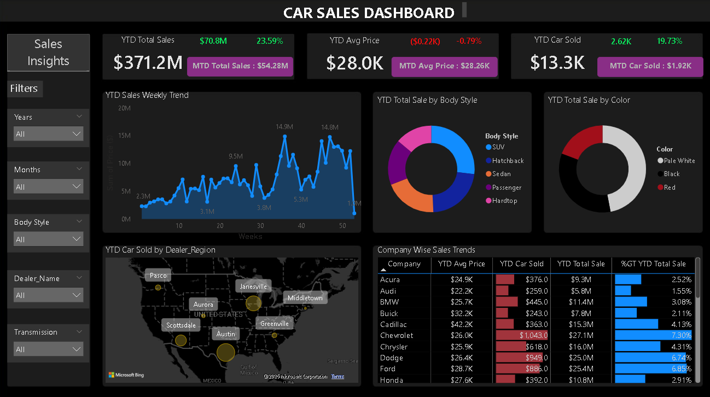

# 🚗 Car Sales Interactive Dashboard

An interactive Power BI dashboard designed to analyze sales performance, identify trends, and track key metrics across different regions and car categories.

### Dashboard Preview

### Key Insights & Features
* **KPI Tracking:** Monitors Year-to-Date (YTD) Total Sales, Average Price, and Cars Sold.
* **Trend Analysis:** Visualizes weekly sales trends to identify peak periods.
* **Category Breakdown:** Analyzes sales by Body Style and Color.
* **Geographic Performance:** Maps sales data by dealer region.

### Tools Used
* **Microsoft Power BI** for data visualization and interactive reporting.
